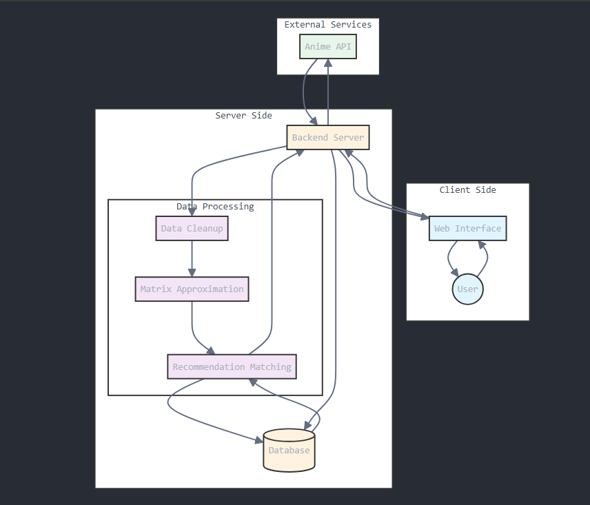

# Anime Recommendation System

A full-stack anime recommendation app that provides personalized suggestions using machine learning and data from MyAnimeList.\

Check it out at https://animerec.net 

## Tech Stack
- **Backend**: Django 4.2
- **Database**: MongoDB
- **ML Libraries**: NumPy, Pandas, Scikit-Learn
- **API**: MyAnimeList API
- **Authentication**: Django Session Auth
- **Cloud and Domain**: AWS, Route43, Caddy

## Features
- Personalized anime recommendations
- User authentication and profile management
- Machine learning-based recommendation engine
- Integration with MyAnimeList API

Full Stack Diagram: 

